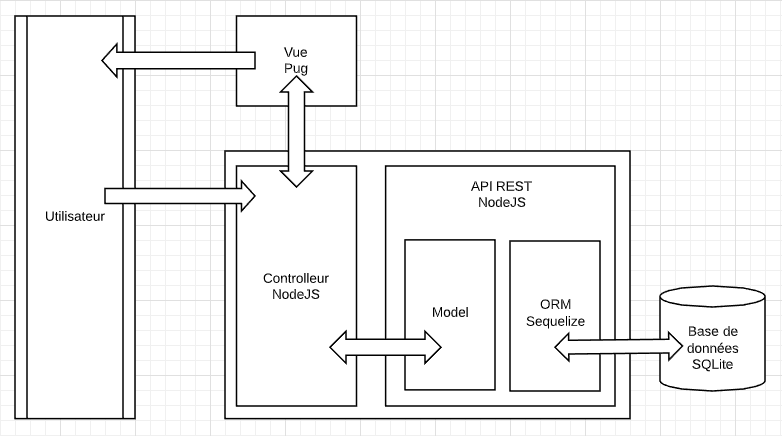
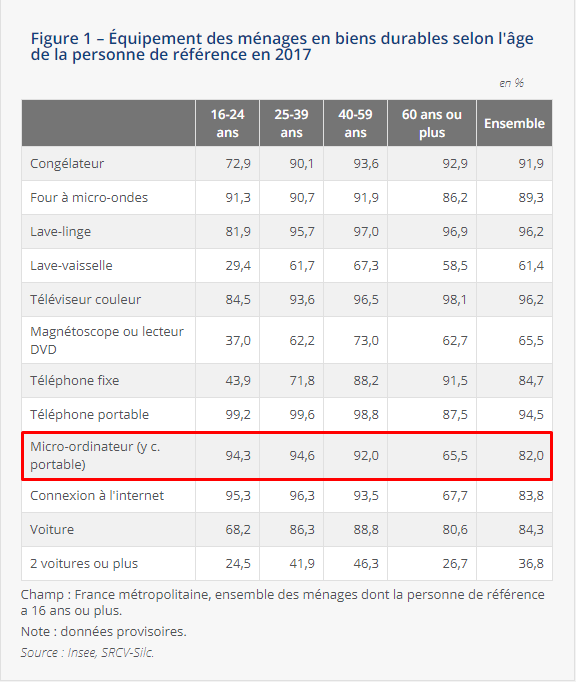
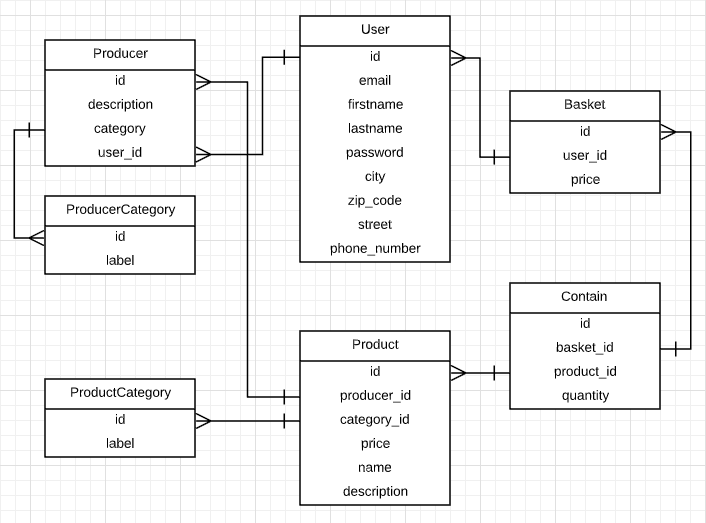
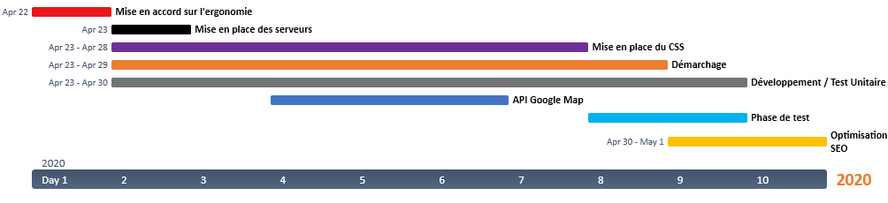
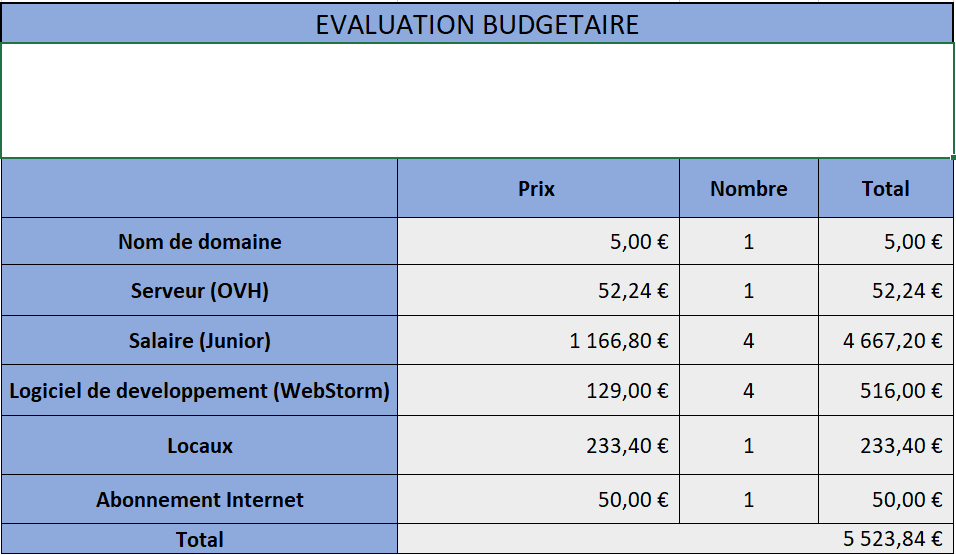

# Déli'Frais

## Introduction

Problème : Vente des produits alimentaires frais pendant le confinement

Avec ce confinement les producteurs de produits alimentaires frais (pêcheur, boucher, viticulteur, maraîchers, fromager, etc..) n'ont pas les moyens de vendre leurs produits aux particuliers. 

De plus, le but du confinement est de diminuer les mouvements des gens, et leurs rencontres.
C'est là que vient s'immiscer notre produit, Déli’Frais, notre but avec ce service est de renouer les liens entre producteurs et particuliers, tout en diminuant leurs mouvements et donc le risque de propagation de ce virus.

En effet ils n’auront plus besoin d’aller au marché ou le risque de transmission du virus est élevé, nous faisons venir le marché directement devant leur porte.

Nous allons mettre en place dans un premier temps un site internet qui permettra de réserver un panier de produits frais aux producteurs de notre région.

Ce panier leur sera ensuite livré à la date prévue par les livreurs que nous sous-traitons.
Ceux-ci ont l’obligation de suivre les consignes d’hygiène mise en place par l’État.
Notre projet s’installe dans un contexte spécial, mais son utilité ne s’arrêtera pas avec la fin du confinement, notre système de livraison et de diminution des contacts actuellement nécessaire, peut être également un renouement avec des personnes à motricités réduites. 

## Architecture du projet

### Choix de l'application Web
Étant donné le contexte actuel, nous avons préféré nous baser une application Web plutôt qu'une application mobile car les français étant confinés, l'utilisation
du téléphone portable perd une partie de son intérêt.
Pour nous assurer de ne pas faire une grossière erreur, nous avons tout de même vérifier le taux de présence d'ordinateurs dans les foyers des français :

[Voir la source](https://www.insee.fr/fr/statistiques/3676680?sommaire=3696937#tableau-figure1)

De plus, en ayant une application web responsive (qui s'adapte aux dimensions de l'écran), on peut utiliser notre application partout.

### Technologies
Pour le prototype de notre application, nous avons décidé d'utiliser les technologies suivantes :
- NodeJS, pour développer le back
- Pug, pour les vues
- SQLite, pour la base de données (utilisé via l'ORM Sequelize)

Ces technologies ont été choisies pour pouvoir rapidement présenter un prototype.
Cependant, dans un contexte de mise en production, nous souhaiterions en utiliser d'autres tels que :
- PHP, pour développer le back de façon plus 'stricte'
- nous conserverions le pug pour sa mise en place simple, mais nous le couplerions à un framework CSS tel que Bootstrap pour respecter notre maquette
    et réaliser une application responsive
- Nous avons utilisé SQLite car il est rapide de mettre en place notre base de données (juste un fichier). 
    Cependant, dans le cadre d'une réel application web, il sera plus pratique d'utiliser MySQL pour séparer de façon plus 'logique' la base de données du code.

### Base de données

### API
TODO: lister les routes ici sous la forme suivante

- `VERBE HTTP` : `/wanted/route/:parameter`

    Body { parameter1, parameter2 }
    
    Return { value }
    
    Short description

## Fonctionnalités majeures
### Visualisation des producteurs de ma région et leurs produits
Possibilité de lister tous les producteurs de ma région ou de restreindre la liste avec une recherche et/ou un filtre :

Possibilité de passer des filtres comme :
- la proximité du producteur (par rapport à notre adresse)
- la catégorie de producteur (sous forme de boutons radios car une seule catégorie par producteur)

Possibilité de faire une recherche par :
- nom de producteur
- catégorie de producteur
- nom de produit
- catégorie de produit

### Connexion/Inscription des utilisateurs et des producteurs
#### Inscription
Les utilisateurs peuvent s'inscrire à notre site web en confiant les informations suivantes : 
- nom
- prenom
- email
- numéro de téléphone
- adresse

Une vérification de l'adresse entrée est effectué. Il faut vérifier que les adresses existent et n'aient pas de fautes pour assurer la livraison.

Lors de l'inscription, on peut dire si on est producteur. 
Si c'est le cas, de nouveaux champs s'offrent à nous :
- catégorie du producteur (maraîcher, viticulteur, fromager, ...)
- une description du producteur, son histoire, son procédé, ... ou toute autre information jugée utile
- l'ajout de produit avec leur nom, catégorie, description et prix

#### Connexion
Les producteurs et les clients se connectent de la même façon : à l'aide de leur adresse email et de leur mot de passe.
Il est possible de sécuriser son compte avec une double authentification (validation par téléphone ou clé de sécurité physique)

##### Gestion de l'utilisateur
Une fois connecté, l'utilisateur a la possibilité de modifier ses informations personnelles. 
Le producteur a aussi la possibilité de modifier ses produits (ajout, modification, suppression), sa description et sa catégorie.

### Gestion du panier
Lorsqu'un client sélectionne un produit et clique sur le bouton '_Acheter_', le produit est ajouté au panier.
Le panier est visible sur la droite de l'écran. On peut modifier les quantités de chaque produit du panier via des boutons '+' et '-'.
Lorsqu'une quantité arrive à '0', le produit est supprimé du panier.
Le prix du panier est calculé par rapport au prix total des produits, plus les frais de livraisons (distance de l'adresse au producteur), plus une marge de bénéfice pour l'entreprise.

### Paiement et envoie des données à notre sous-traitant
En validant notre panier, nous avons un résumé de notre commande, un formulaire pour entrer nos coordonnées bancaires (ou notre paypal) et un bouton pour payer.
Lorsque le paiement est validé, 3 notifications sont envoyées aux différents acteurs de Déli'Frais :
- Une validation de la commande pour le client
- Le panier du client est envoyé au fournisseur pour qu'il prépare la commande (peut être envoyé à plusieurs producteurs selon la commande)
- Le panier du client ainsi que les informations (adresses, numéros de téléphone et noms) du client et des producteurs à notre sous-traitant pour effectuer la livraison

La durée estimée de livraison devra s'adapter avec les disponibilités de notre sous-traitant.
Il est possible d'entrer des codes de promotion pour réduire le prix du panier.

### Gestion des favoris
Un utilisateur peut ajouter un producteur à ses favoris pour facilement le retrouver lors de futurs commandes.
Ces producteurs sont trouvables dans l'onglet "_Mes favoris_".

### Stratégie de fidélisation
Lorsqu'un utilisateur n'a pas commandé depuis longtemps ou qu'un de ses producteurs favoris baisse ses prix ou ajoute un nouveau produit, un email est envoyé au client pour le prévenir.

## Diagramme de GANTT

Nous souhaitons investir un jour pour se mettre d'accord sur l'ergonomie du site ainsi que son style. 
Réaliser des maquettes de toutes les pages avec le meilleur design possible.

Une fois d'accord, on se divise les tâches entre le développement front et le développement back. 
Un membre de l'équipe se réservera un jour pour prévoir le déploiement des serveurs, les autres travailleront en local pendant ce temps.
En parallèle du développement, nous contacterons divers producteurs de notre région pour leur présenter notre service et les y inviter.

Au bout de 8 jours de développement, on commence les phases de tests pour enchainer sur la SEO (optimisation du référencement).
Le projet pourrait donc se terminer en 11 jours de travail. 

## Évaluation budgétaire

Vous trouverez dans ce répertoire git le fichier excel avec l'évaluation budgétaire (dans `./documents/`)